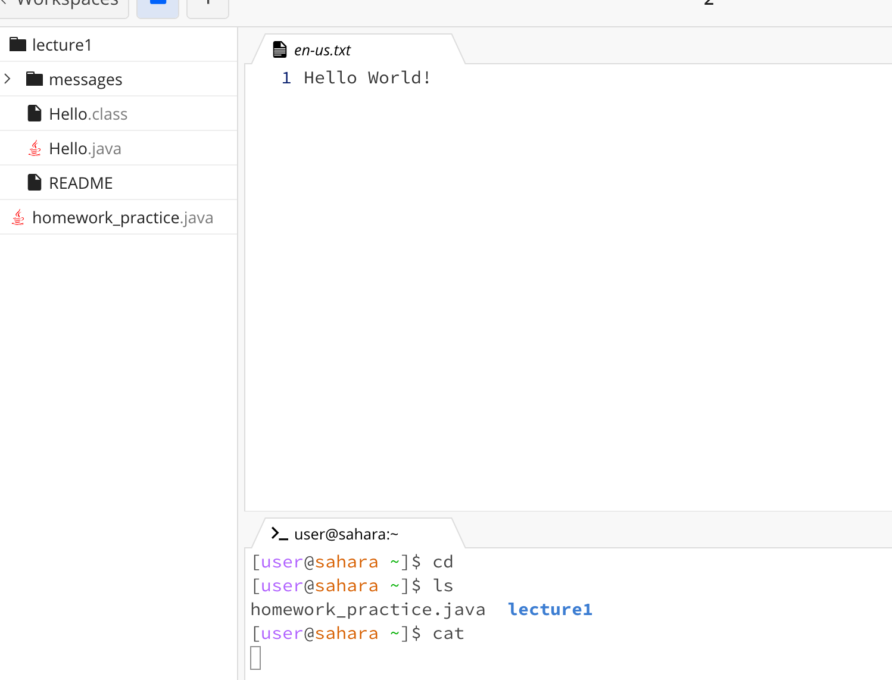
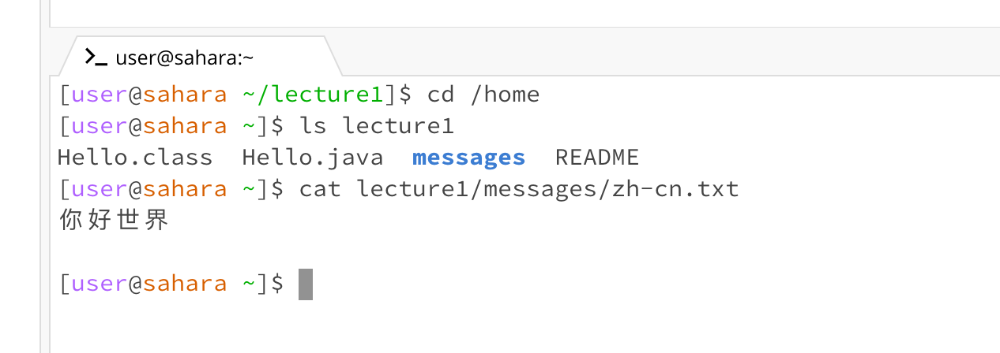
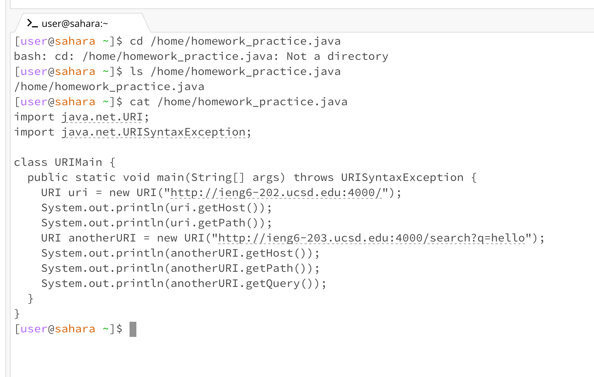

# Week 1 Lab Report

1. Share an example of using the command with no arguments.
1. Share an exmaple of using the command with a path to a directory as an argument.
1. Share an example of using the command with a path to a file as an argument.

## 1. No Arguments

### Output

A screenshot or Markdown code block showing the command and its output.

### Working Directory

- `cd`: The current working directory was `/home`
- `ls`: The current working directory was `/home`
- `cat`: The current working directory was `/home`

### Explanation

A sentence or two explaining why you got that output (e.g. what was in the filesystem, what it meant to have no arguments).

- `cd`: when tpying `cd` it shows nothing because there is no argument followed by `cd`
- `ls`: when tpying `ls` it displays the names of files contained within home directory
- `cat`: when tpying `cat` it shows nothing because there is no argument followed by `cat`

### Analysis

Indicate whether the output is an error or not, and if it’s an error, explain why it’s an error.

- `cd`: typing `cd` without arguments will not show an error in the output becasue it's do nothing
- `ls`: typing `cat` without arguments is not wrong
- `cat`: typing `ls` list directory contents so there is no error

## 2. A path to a directory as an argument.

### Output

A screenshot or Markdown code block showing the command and its output

### Working Directory

- `cd`: The current working directory was `/home/lecture`
- `ls`: The current working directory was `/home`
- `cat`: The current working directory was `/home`

### Explanation

A sentence or two explaining why you got that output (e.g. what was in the filesystem, what it meant to have no arguments).

- `cd`: The current working directory was /home/lecture, by typing cd /home working directory changed to its parent dirctory, which is /home
- `ls`: ls lecturel means list all the the names of files contained within lecturel1 directory
- `cat`: The current working directory was/home. by typing cat lecture1/messages/zh-cn.txt, it shows the contents with zh-cn.txt.

### Analysis

Indicate whether the output is an error or not, and if it’s an error, explain why it’s an error.

- There is no error because I use the right absolute path and relative path to access the target directories

## 3. A path to a file as an argument.

A screenshot or Markdown code block showing the command and its output

### Working Directory

What the working directory was when the command was run

- `cd`: `/home`
- `ls`: `/home`
- `cat`: `/home`

### Explanation

A sentence or two explaining why you got that output (e.g. what was in the filesystem, what it meant to have no arguments)

- `cd`: Because cd means change directory, the agrument followed by cd is a path to a file, thus causing an error
- `ls`: Because our command is a list of a path to the .java file so its displays the path
- `cat`: Because this agrument followed by cat is to print the contents within the `homework_practice.java`

### Analysis

Indicate whether the output is an error or not, and if it’s an error, explain why it’s an error.

- `cd`: Because `cd` means change directory, the agrument followed by cd is a path to a file, thus causing an error
- `ls`: No error
- `cat`: No error
