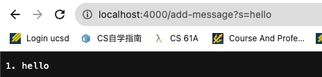
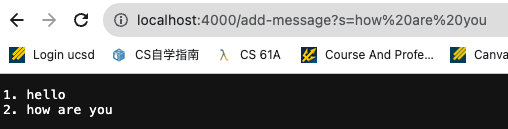
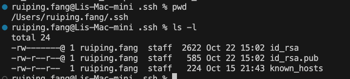
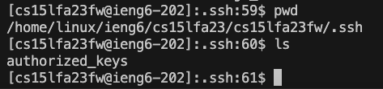
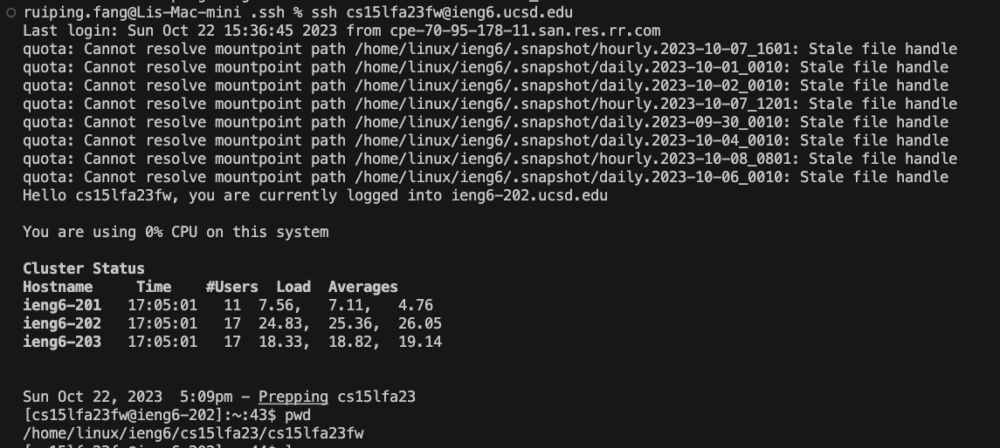

# Week 2 Lab Report- Servers and SSH Keys - Ruiping

## Part 1

```Java
import java.io.IOException;
import java.net.URLDecoder;
import java.net.URI;

class Handler implements URLHandler {
    // The one bit of state on the server: a number that will be manipulated by
    // various requests.
    String message = "";
    int num = 0;

    public String handleRequest(URI url) {
        if (url.getPath().contains("/add-message")) {
            String[] parameters = url.getQuery().split("=");
            if (parameters[0].equals("s")) {
                num++;
                if (num == 1){
                    message += String.format("%d. %s", num, parameters[1]);
                } else {
                    message += String.format("\n%d. %s", num, parameters[1]);
                }
                return message;
            }
        }
        return "404 Not Found!";
    }
}

class StringSever {
    public static void main(String[] args) throws IOException {
        if(args.length == 0){
            System.out.println("Missing port number! Try any number between 1024 to 49151");
            return;
        }

        int port = Integer.parseInt(args[0]);


        Server.start(port, new Handler());
    }
}

```




    q1 and q2

- StringSever's `main` function were called when server start, agrument is port `4000`
- When the first request `/add-message?s=Hello` come, it called `handleRequest` with the agrument of `http://localhost:4000/add-message?s=hello`

- When the second request `/add-message?s=how are you` come, it called `handleRequest` with the agrument of `http://localhost:4000/add-message?s=how%20are%20you`

  q3

- The first request come `num = 1`, `"1. hello"` were added to `message`
- The second request come `num = 2`, `"1. hello\n2. how are you"` were added to `message`

## Part 2



- The path to the private key for SSH key for logging into ieng6



- The path to the public key for SSH key for logging into ieng6



- A terminal interaction where I log into ieng6 with my course-specific account without being asked for a password.

## Part 3

- What I learned from week2 and week3
  - Use `ssh` with my username and pwd from vscode to log into `ieng`
  - Bulid and run the server on my computer
  - `scp`: secure copy and it's used to transfer file securely over a network using ssh protocal
  - `mkdir .ssh` command: set up a user's ssh configuration and key storage directory
