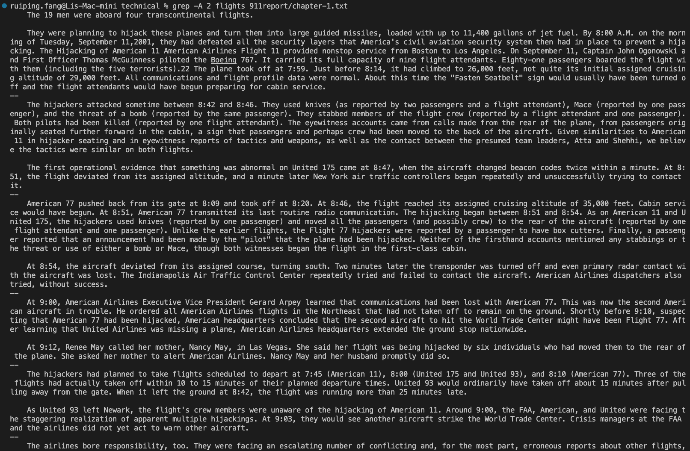
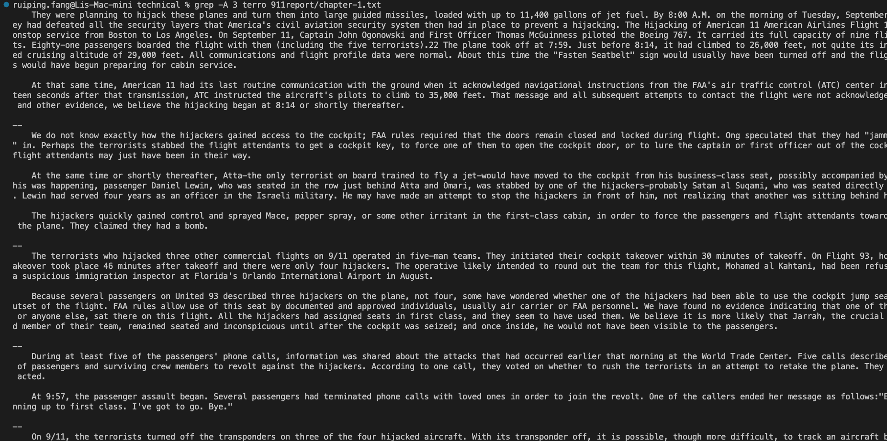
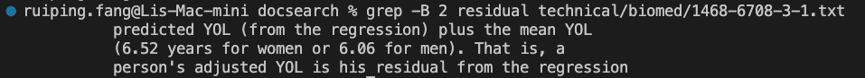
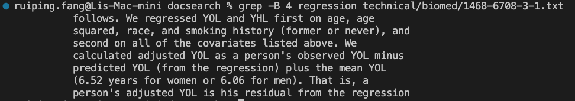
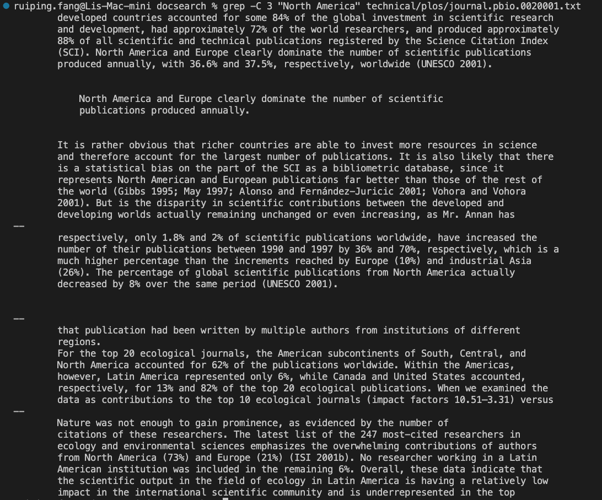
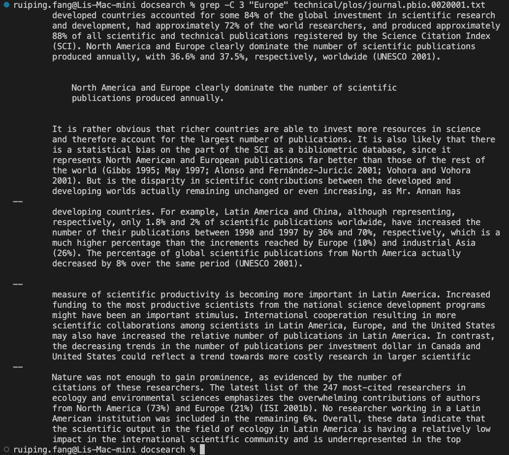
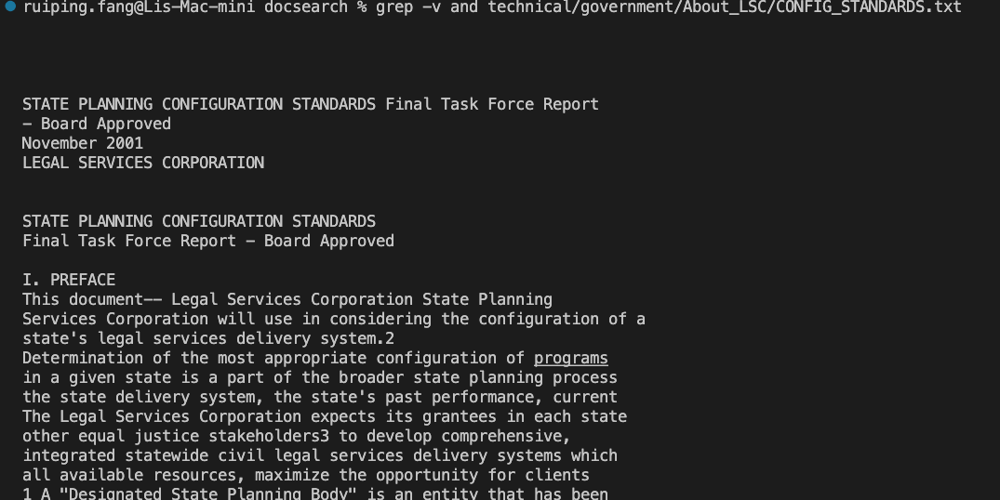
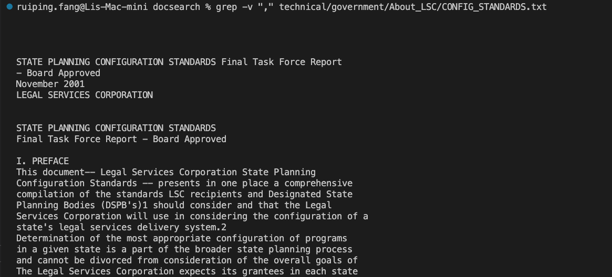

# CS15L Lab Report 3

## Part 1-Bugs

- A failure-inducing input for the buggy program, as a JUnit test and any associated code (write it as a code block in Markdown)

I chose the `reverseInPlace` method from the `ArrayExamples` class. I used the array `{1, 2, 3, 4}` as input in my test, which resulted in a failure. Here is my unit test:

```java
@Test
public void testReverseInPlace2() {
    int[] input1 = { 1,2,3,4 };
    ArrayExamples.reverseInPlace(input1);
    assertArrayEquals(new int[]{ 4,3,2,1 }, input1);
}
```

- An input that doesn’t induce a failure, as a JUnit test and any associated code (write it as a code block in Markdown)

I chose the `reverseInPlace` method from the `ArrayExamples` class. I used the array `{1, 1, 1}` as input in my test, which didn't result in a failure. Here is my unit test:

```java
@Test
public void testReverseInPlace1() {
    int[] input1 = { 1,1,1 };
    ArrayExamples.reverseInPlace(input1);
    assertArrayEquals(new int[]{ 1,1,1 }, input1);
}
```

- The symptom, as the output of running the tests (provide it as a screenshot of running JUnit with at least the two inputs above)

When running the first test, it failed with an error message complaining about `arrays first differed at element [2]; expected:<2> but was:<3>`.
The second test passed.

Here is the screenshoot:


- The bug, as the before-and-after code change required to fix it (as two code blocks in Markdown)

The original code before bug fix:

```java
public class ArrayExamples {

  // Changes the input array to be in reversed order
  static void reverseInPlace(int[] arr) {
    for(int i = 0; i < arr.length; i += 1) {
      arr[i] = arr[arr.length - i - 1];
    }
  }

  // Returns a *new* array with all the elements of the input array in reversed
  // order
  static int[] reversed(int[] arr) {
    int[] newArray = new int[arr.length];
    for(int i = 0; i < arr.length; i += 1) {
      arr[i] = newArray[arr.length - i - 1];
    }
    return arr;
  }

  // Averages the numbers in the array (takes the mean), but leaves out the
  // lowest number when calculating. Returns 0 if there are no elements or just
  // 1 element in the array
  static double averageWithoutLowest(double[] arr) {
    if(arr.length < 2) { return 0.0; }
    double lowest = arr[0];
    for(double num: arr) {
      if(num < lowest) { lowest = num; }
    }
    double sum = 0;
    for(double num: arr) {
      if(num != lowest) { sum += num; }
    }
    return sum / (arr.length - 1);
  }


}
```

The code after bug fix:

```java
public class ArrayExamples {

  // Changes the input array to be in reversed order
  static void reverseInPlace(int[] arr) {
    for(int i = 0; i < arr.length/2; i += 1) {
      int temp = arr[i];
      arr[i] = arr[arr.length - i - 1];
      arr[arr.length - i - 1] = temp;
    }
  }

  // Returns a *new* array with all the elements of the input array in reversed
  // order
  static int[] reversed(int[] arr) {
    int[] newArray = new int[arr.length];
    for(int i = 0; i < arr.length; i += 1) {
      newArray[arr.length - i - 1] = arr[i];
    }
    return newArray;
  }

  // Averages the numbers in the array (takes the mean), but leaves out the
  // lowest number when calculating. Returns 0 if there are no elements or just
  // 1 element in the array
  static double averageWithoutLowest(double[] arr) {
    if(arr.length < 2) { return 0.0; }
    double lowest = arr[0];
    for(double num: arr) {
      if(num < lowest) { lowest = num; }
    }
    double sum = 0;
    for(double num: arr) {
      sum += num;
    }
    return (sum - lowest)/ (arr.length - 1);
  }
}
```

## Briefly describe why the fix addresses the issue.

The `reverseInPlace` method has two issues:

- It only performed half of the swap
- The num of iterations in the for loop is too many

By using a `temp` variable and half of the iterations, we fixed the `reverseInPlace` method.

## Part 2

The command I chose was `grep`. And the four options I chose were:

- `-A`

  I found it using `man grep` command:

  > -A num, --after-context=num
  >
  > Print num lines of trailing context after each match. See also the -B and -C options.

  - example 1: `grep -A 2 flights 911report/chapter-1.txt`

    

  - example 2: `grep -A 3 terro 911report/chapter-1.txt`

    

- `-B`

  I found it using `man grep` command:

  > -B num, --before-context=num
  >
  > Print num lines of leading context before each match. See also the -A and -C options.

  - example 3: `grep -B 2 residual technical/biomed/1468-6708-3-1.txt`

    

  - example 4: `grep -B 4 regression technical/biomed/1468-6708-3-1.txt`

    

- `-C`

  I found it using `man grep` command:

  > -C num, --context=num
  >
  > Print num lines of leading and trailing context surrounding each match. See also the -A and -B options.

  - example 5: `grep -C 2 "data" technical/plos/journal.pbio.0020013.txt`

    

  - example 6: `grep -C 3 "Europe" technical/plos/journal.pbio.0020001.tx`

    

- `-v`

  I found it using `man grep` command:

  > -v, --invert-match
  >
  > Selected lines are those not matching any of the specified patterns.

  - example 7: `grep -v and technical/government/About_LSC/CONFIG_STANDARDS.txt`

    

  - example 8: `grep -v "," technical/government/About_LSC/CONFIG_STANDARDS.txt`

    
