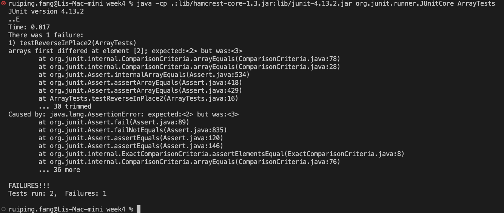
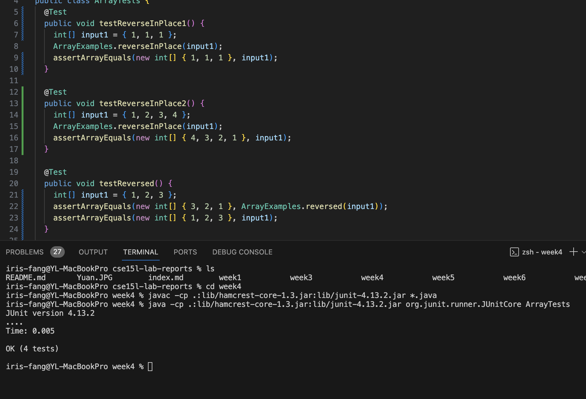

# CS15L Lab Report 3

## Part 1-Bugs

- A failure-inducing input for the buggy program

```java
@Test
public void testReverseInPlace2() {
    int[] input1 = { 1,2,3,4 };
    ArrayExamples.reverseInPlace(input1);
    assertArrayEquals(new int[]{ 4,3,2,1 }, input1);
}
```

- An input that doesn’t induce a failure

```java
@Test
public void testReverseInPlace1() {
    int[] input1 = { 1,1,1 };
    ArrayExamples.reverseInPlace(input1);
    assertArrayEquals(new int[]{ 1,1,1 }, input1);
}
```

- The symptom, as the output of running the tests

This is the screenshot for the failure-inducing input



This is the screenshot for the input that doesn’t induce a failure:


The original code before bug fix:

```java
  static void reverseInPlace(int[] arr) {
    for(int i = 0; i < arr.length; i += 1) {
      arr[i] = arr[arr.length - i - 1];
    }
  }

```

The code after bug fix:

```java

  static void reverseInPlace(int[] arr) {
    for(int i = 0; i < arr.length/2; i += 1) {
      int temp = arr[i];
      arr[i] = arr[arr.length - i - 1];
      arr[arr.length - i - 1] = temp;
    }
  }

```

## Briefly describe why the fix addresses the issue.

The `reverseInPlace` method has two issues:

- It only performed half of the swap
- The num of iterations in the for loop is too many

By using a `temp` variable and half of the iterations, we fixed the `reverseInPlace` method.

## Part 2

The command I chose was `grep`. The reason why I chose it because it's a useful command for searching
And the four options I chose were:

- `-A`

  I found it using `man grep` command:

  > -A num, --after-context=num
  >
  > Print num lines of trailing context after each match. See also the -B and -C options.

  - example 1: `grep -A 2 flights 911report/chapter-1.txt`

    - Here is the command line:

  ```
  iris-fang@YL-MacBookPro technical % grep -A 2 flights 911report/chapter-1.txt
  ```

  ```
  The 19 men were aboard four transcontinental flights.

  They were planning to hijack these planes and turn them into large guided missiles, loaded with up to 11,400 gallons of jet fuel. By 8:00 A.M. on the morning of Tuesday, September 11,2001, they had defeated all the security layers that America's civil aviation security system then had in place to prevent a hijacking. The Hijacking of American 11 American Airlines Flight 11 provided nonstop service from Boston to Los Angeles. On September 11, Captain John Ogonowski and First Officer Thomas McGuinness piloted the Boeing 767. It carried its full capacity of nine flight attendants. Eighty-one passengers boarded the flight with them (including the five terrorists).22 The plane took off at 7:59. Just before 8:14, it had climbed to 26,000 feet, not quite its initial assigned cruising altitude of 29,000 feet. All communications and flight profile data were normal. About this time the "Fasten Seatbelt" sign would usually have been turned off and the flight attendants would have begun preparing for cabin service.
  --
  The hijackers attacked sometime between 8:42 and 8:46. They used knives (as reported by two passengers and a flight attendant), Mace (reported by one passenger), and the threat of a bomb (reported by the same passenger). They stabbed members of the flight crew (reported by a flight attendant and one passenger). Both pilots had been killed (reported by one flight attendant). The eyewitness accounts came from calls made from the rear of the plane, from passengers originally seated further forward in the cabin, a sign that passengers and perhaps crew had been moved to the back of the aircraft. Given similarities to American 11 in hijacker seating and in eyewitness reports of tactics and weapons, as well as the contact between the presumed team leaders, Atta and Shehhi, we believe the tactics were similar on both flights.

  The first operational evidence that something was abnormal on United 175 came at 8:47, when the aircraft changed beacon codes twice within a minute. At 8:51, the flight deviated from its assigned altitude, and a minute later New York air traffic controllers began repeatedly and unsuccessfully trying to contact it.
  --
  American 77 pushed back from its gate at 8:09 and took off at 8:20. At 8:46, the flight reached its assigned cruising altitude of 35,000 feet. Cabin service would have begun. At 8:51, American 77 transmitted its last routine radio communication. The hijacking began between 8:51 and 8:54. As on American 11 and United 175, the hijackers used knives (reported by one passenger) and moved all the passengers (and possibly crew) to the rear of the aircraft (reported by one flight attendant and one passenger). Unlike the earlier flights, the Flight 77 hijackers were reported by a passenger to have box cutters. Finally, a passenger reported that an announcement had been made by the "pilot" that the plane had been hijacked. Neither of the firsthand accounts mentioned any stabbings or the threat or use of either a bomb or Mace, though both witnesses began the flight in the first-class cabin.

  At 8:54, the aircraft deviated from its assigned course, turning south. Two minutes later the transponder was turned off and even primary radar contact with the aircraft was lost. The Indianapolis Air Traffic Control Center repeatedly tried and failed to contact the aircraft. American Airlines dispatchers also tried, without success.
  --
  At 9:00, American Airlines Executive Vice President Gerard Arpey learned that communications had been lost with American 77. This was now the second American aircraft in trouble. He ordered all American Airlines flights in the Northeast that had not taken off to remain on the ground. Shortly before 9:10, suspecting that American 77 had been hijacked, American headquarters concluded that the second aircraft to hit the World Trade Center might have been Flight 77. After learning that United Airlines was missing a plane, American Airlines headquarters extended the ground stop nationwide.

  At 9:12, Renee May called her mother, Nancy May, in Las Vegas. She said her flight was being hijacked by six individuals who had moved them to the rear of the plane. She asked her mother to alert American Airlines. Nancy May and her husband promptly did so.
  --
  The hijackers had planned to take flights scheduled to depart at 7:45 (American 11), 8:00 (United 175 and United 93), and 8:10 (American 77). Three of the flights had actually taken off within 10 to 15 minutes of their planned departure times. United 93 would ordinarily have taken off about 15 minutes after pulling away from the gate. When it left the ground at 8:42, the flight was running more than 25 minutes late.

  As United 93 left Newark, the flight's crew members were unaware of the hijacking of American 11. Around 9:00, the FAA, American, and United were facing the staggering realization of apparent multiple hijackings. At 9:03, they would see another aircraft strike the World Trade Center. Crisis managers at the FAA and the airlines did not yet act to warn other aircraft.
  --
  The airlines bore responsibility, too. They were facing an escalating number of conflicting and, for the most part, erroneous reports about other flights, as well as a continuing lack of vital information from the FAA about the hijacked flights. We found no evidence, however, that American Airlines sent any cockpit warnings to its aircraft on 9/11. United's first decisive action to notify its airborne aircraft to take defensive action did not come until 9:19, when a United flight dispatcher, Ed Ballinger, took the initiative to begin transmitting warnings to his 16 transcontinental flights: "Beware any cockpit intrusion- Two a/c [aircraft] hit World Trade Center." One of the flights that received the warning was United 93. Because Ballinger was still responsible for his other flights as well as Flight 175, his warning message was not transmitted to Flight 93 until 9:23.

  By all accounts, the first 46 minutes of Flight 93's cross-country trip proceeded routinely. Radio communications from the plane were normal. Heading, speed, and altitude ran according to plan. At 9:24, Ballinger's warning to United 93 was received in the cockpit. Within two minutes, at 9:26, the pilot, Jason Dahl, responded with a note of puzzlement: "Ed, confirm latest mssg plz-Jason."
  --
  The terrorists who hijacked three other commercial flights on 9/11 operated in five-man teams. They initiated their cockpit takeover within 30 minutes of takeoff. On Flight 93, however, the takeover took place 46 minutes after takeoff and there were only four hijackers. The operative likely intended to round out the team for this flight, Mohamed al Kahtani, had been refused entry by a suspicious immigration inspector at Florida's Orlando International Airport in August.

  Because several passengers on United 93 described three hijackers on the plane, not four, some have wondered whether one of the hijackers had been able to use the cockpit jump seat from the outset of the flight. FAA rules allow use of this seat by documented and approved individuals, usually air carrier or FAA personnel. We have found no evidence indicating that one of the hijackers, or anyone else, sat there on this flight. All the hijackers had assigned seats in first class, and they seem to have used them. We believe it is more likely that Jarrah, the crucial pilot-trained member of their team, remained seated and inconspicuous until after the cockpit was seized; and once inside, he would not have been visible to the passengers.
  --
  At least two callers from the flight reported that the hijackers knew that passengers were making calls but did not seem to care. It is quite possible Jarrah knew of the success of the assault on the World Trade Center. He could have learned of this from messages being sent by United Airlines to the cockpits of its transcontinental flights, including Flight 93, warning of cockpit intrusion and telling of the New York attacks. But even without them, he would certainly have understood that the attacks on the World Trade Center would already have unfolded, given Flight 93's tardy departure from Newark. If Jarrah did know that the passengers were making calls, it might not have occurred to him that they were certain to learn what had happened in New York, thereby defeating his attempts at deception.

  At least ten passengers and two crew members shared vital information with family, friends, colleagues, or others on the ground. All understood the plane had been hijacked. They said the hijackers wielded knives and claimed to have a bomb. The hijackers were wearing red bandanas, and they forced the passengers to the back of the aircraft.
  --
  Passengers on three flights reported the hijackers' claim of having a bomb. The FBI told us they found no trace of explosives at the crash sites. One of the passengers who mentioned a bomb expressed his belief that it was not real. Lacking any evidence that the hijackers attempted to smuggle such illegal items past the security screening checkpoints, we believe the bombs were probably fake.

  During at least five of the passengers' phone calls, information was shared about the attacks that had occurred earlier that morning at the World Trade Center. Five calls described the intent of passengers and surviving crew members to revolt against the hijackers. According to one call, they voted on whether to rush the terrorists in an attempt to retake the plane. They decided, and acted.
  --
  Another commercial aircraft in the vicinity then radioed in with "reports over the radio of a commuter plane hitting the World Trade Center." The controller spent the next several minutes handing off the other flights on his scope to other controllers and moving aircraft out of the way of the unidentified aircraft (believed to be United 175) as it moved southwest and then turned northeast toward New York City.

  At about 8:55, the controller in charge notified a New York Center manager that she believed United 175 had also been hijacked. The manager tried to notify the regional managers and was told that they were discussing a hijacked aircraft (presumably American 11) and refused to be disturbed. At 8:58, the New York Center controller searching for United 175 told another New York controller "we might have a hijack over here, two of them."
  --
  The controller responded, seconds later: "Somebody call Cleveland?"This was followed by a second radio transmission, with sounds of screaming. The Cleveland Center controllers began to try to identify the possible source of the transmissions, and noticed that United 93 had descended some 700 feet. The controller attempted again to raise United 93 several times, with no response. At 9:30, the controller began to poll the other flights on his frequency to determine if they had heard the screaming; several said they had.

  At 9:32, a third radio transmission came over the frequency:"Keep remaining sitting. We have a bomb on board." The controller understood, but chose to respond: "Calling Cleveland Center, you're unreadable. Say again, slowly." He notified his supervisor, who passed the notice up the chain of command. By 9:34, word of the hijacking had reached FAA headquarters.
  ```

  - example 2: `grep -A 3 terro 911report/chapter-1.txt`

    - Here is the command line:

    ```
    iris-fang@YL-MacBookPro technical % grep -A 3 terro 911report/chapter-1.txt > grep-a2.txt
    ```

    Output:

    ```
    They were planning to hijack these planes and turn them into large guided missiles, loaded with up to 11,400 gallons of jet fuel. By 8:00 A.M. on the morning of Tuesday, September 11,2001, they had defeated all the security layers that America's civil aviation security system then had in place to prevent a hijacking. The Hijacking of American 11 American Airlines Flight 11 provided nonstop service from Boston to Los Angeles. On September 11, Captain John Ogonowski and First Officer Thomas McGuinness piloted the Boeing 767. It carried its full capacity of nine flight attendants. Eighty-one passengers boarded the flight with them (including the five terrorists).22 The plane took off at 7:59. Just before 8:14, it had climbed to 26,000 feet, not quite its initial assigned cruising altitude of 29,000 feet. All communications and flight profile data were normal. About this time the "Fasten Seatbelt" sign would usually have been turned off and the flight attendants would have begun preparing for cabin service.

    At that same time, American 11 had its last routine communication with the ground when it acknowledged navigational instructions from the FAA's air traffic control (ATC) center in Boston. Sixteen seconds after that transmission, ATC instructed the aircraft's pilots to climb to 35,000 feet. That message and all subsequent attempts to contact the flight were not acknowledged. From this and other evidence, we believe the hijacking began at 8:14 or shortly thereafter.

    --
    We do not know exactly how the hijackers gained access to the cockpit; FAA rules required that the doors remain closed and locked during flight. Ong speculated that they had "jammed their way" in. Perhaps the terrorists stabbed the flight attendants to get a cockpit key, to force one of them to open the cockpit door, or to lure the captain or first officer out of the cockpit. Or the flight attendants may just have been in their way.

    At the same time or shortly thereafter, Atta-the only terrorist on board trained to fly a jet-would have moved to the cockpit from his business-class seat, possibly accompanied by Omari. As this was happening, passenger Daniel Lewin, who was seated in the row just behind Atta and Omari, was stabbed by one of the hijackers-probably Satam al Suqami, who was seated directly behind Lewin. Lewin had served four years as an officer in the Israeli military. He may have made an attempt to stop the hijackers in front of him, not realizing that another was sitting behind him.

    The hijackers quickly gained control and sprayed Mace, pepper spray, or some other irritant in the first-class cabin, in order to force the passengers and flight attendants toward the rear of the plane. They claimed they had a bomb.

    --
    The terrorists who hijacked three other commercial flights on 9/11 operated in five-man teams. They initiated their cockpit takeover within 30 minutes of takeoff. On Flight 93, however, the takeover took place 46 minutes after takeoff and there were only four hijackers. The operative likely intended to round out the team for this flight, Mohamed al Kahtani, had been refused entry by a suspicious immigration inspector at Florida's Orlando International Airport in August.

    Because several passengers on United 93 described three hijackers on the plane, not four, some have wondered whether one of the hijackers had been able to use the cockpit jump seat from the outset of the flight. FAA rules allow use of this seat by documented and approved individuals, usually air carrier or FAA personnel. We have found no evidence indicating that one of the hijackers, or anyone else, sat there on this flight. All the hijackers had assigned seats in first class, and they seem to have used them. We believe it is more likely that Jarrah, the crucial pilot-trained member of their team, remained seated and inconspicuous until after the cockpit was seized; and once inside, he would not have been visible to the passengers.

    --
    During at least five of the passengers' phone calls, information was shared about the attacks that had occurred earlier that morning at the World Trade Center. Five calls described the intent of passengers and surviving crew members to revolt against the hijackers. According to one call, they voted on whether to rush the terrorists in an attempt to retake the plane. They decided, and acted.

    At 9:57, the passenger assault began. Several passengers had terminated phone calls with loved ones in order to join the revolt. One of the callers ended her message as follows:"Everyone's running up to first class. I've got to go. Bye."

    --
    On 9/11, the terrorists turned off the transponders on three of the four hijacked aircraft. With its transponder off, it is possible, though more difficult, to track an aircraft by its primary radar returns. But unlike transponder data, primary radar returns do not show the aircraft's identity and altitude. Controllers at centers rely so heavily on transponder signals that they usually do not display primary radar returns on their radar scopes. But they can change the configuration of their scopes so they can see primary radar returns. They did this on 9/11 when the transponder signals for three of the aircraft disappeared.

    Before 9/11, it was not unheard of for a commercial aircraft to deviate slightly from its course, or for an FAA controller to lose radio contact with a pilot for a short period of time. A controller could also briefly lose a commercial aircraft's transponder signal, although this happened much less frequently. However, the simultaneous loss of radio and transponder signal would be a rare and alarming occurrence, and would normally indicate a catastrophic system failure or an aircraft crash. In all of these instances, the job of the controller was to reach out to the aircraft, the parent company of the aircraft, and other planes in the vicinity in an attempt to reestablish communications and set the aircraft back on course. Alarm bells would not start ringing until these efforts-which could take five minutes or more-were tried and had failed.

    --
    The threat of Soviet bombers diminished significantly as the Cold War ended, and the number of NORAD alert sites was reduced from its Cold War high of 26. Some within the Pentagon argued in the 1990s that the alert sites should be eliminated entirely. In an effort to preserve their mission, members of the air defense community advocated the importance of air sovereignty against emerging "asymmetric threats" to the United States: drug smuggling, "non-state and state-sponsored terrorists," and the proliferation of weapons of mass destruction and ballistic missile technology.

    NORAD perceived the dominant threat to be from cruise missiles. Other threats were identified during the late 1990s, including terrorists' use of aircraft as weapons. Exercises were conducted to counter this threat, but they were not based on actual intelligence. In most instances, the main concern was the use of such aircraft to deliver weapons of mass destruction.

    Prior to 9/11, it was understood that an order to shoot down a commercial aircraft would have to be issued by the National Command Authority (a phrase used to describe the president and secretary of defense). Exercise planners also assumed that the aircraft would originate from outside the United States, allowing time to identify the target and scramble interceptors. The threat of terrorists hijacking commercial airliners within the United States-and using them as guided missiles-was not recognized by NORAD before 9/11. Notwithstanding the identification of these emerging threats, by 9/11 there were only seven alert sites left in the United States, each with two fighter aircraft on alert. This led some NORAD commanders to worry that NORAD was not postured adequately to protect the United States.

    In the United States, NORAD is divided into three sectors. On 9/11, all the hijacked aircraft were in NORAD's Northeast Air Defense Sector (also known as NEADS), which is based in Rome, New York. That morning NEADS could call on two alert sites, each with one pair of ready fighters: Otis Air National Guard Base in Cape Cod, Massachusetts, and Langley Air Force Base in Hampton, Virginia.

    --
    At the White House, the video teleconference was conducted from the Situation Room by Richard Clarke, a special assistant to the president long involved in counterterrorism. Logs indicate that it began at 9:25 and included the CIA; the FBI; the departments of State, Justice, and Defense; the FAA; and the White House shelter. The FAA and CIA joined at 9:40. The first topic addressed in the White House video teleconference-at about 9:40-was the physical security of the President, the White House, and federal agencies. Immediately thereafter it was reported that a plane had hit the Pentagon. We found no evidence that video teleconference participants had any prior information that American 77 had been hijacked and was heading directly toward Washington. Indeed, it is not clear to us that the video teleconference was fully under way before 9:37, when the Pentagon was struck.

    Garvey, Belger, and other senior officials from FAA headquarters participated in this video teleconference at various times. We do not know who from Defense participated, but we know that in the first hour none of the personnel involved in managing the crisis did. And none of the information conveyed in the White House video teleconference, at least in the first hour, was being passed to the NMCC. As one witness recalled, "[It] was almost like there were parallel decisionmaking processes going on; one was a voice conference orchestrated by the NMCC . . . and then there was the [White House video teleconference]. . . . [I]n my mind they were competing venues for command and control and decisionmaking."

    --
    The Pentagon Teleconferences. Inside the National Military Command Center, the deputy director for operations immediately thought the second strike was a terrorist attack. The job of the NMCC in such an emergency is to gather the relevant parties and establish the chain of command between the National Command Authority-the president and the secretary of defense- and those who need to carry out their orders.

    On the morning of September 11, Secretary Rumsfeld was having breakfast at the Pentagon with a group of members of Congress. He then returned to his office for his daily intelligence briefing. The Secretary was informed of the second strike in New York during the briefing; he resumed the briefing while awaiting more information. After the Pentagon was struck, Secretary Rumsfeld went to the parking lot to assist with rescue efforts.


    ```

- `-B`

  I found it using `man grep` command:

  > -B num, --before-context=num
  >
  > Print num lines of leading context before each match. See also the -A and -C options.

  - example 1: `grep -B 2 residual technical/biomed/1468-6708-3-1.txt`

    - Here is the command line:

    ```
    iris-fang@YL-MacBookPro docsearch % grep -B 2 residual technical/biomed/1468-6708-3-1.txt > grep-b1.txt
    ```

    Output:

    ```
    predicted YOL (from the regression) plus the mean YOL
    (6.52 years for women or 6.06 for men). That is, a
    person's adjusted YOL is his residual from the regression

    ```

  - example 2: `grep -B 4 regression technical/biomed/1468-6708-3-1.txt`

    Here is the command line:

    ```
    iris-fang@YL-MacBookPro docsearch % grep -B 4 regression technical/biomed/1468-6708-3-1.txt
    ```

    Output:

    ```
    follows. We regressed YOL and YHL first on age, age
    squared, race, and smoking history (former or never), and
    second on all of the covariates listed above. We
    calculated adjusted YOL as a person's observed YOL minus
    predicted YOL (from the regression) plus the mean YOL
    --
    (6.52 years for women or 6.06 for men). That is, a
    person's adjusted YOL is his residual from the regression

    ```

- `-C`

  I found it using `man grep` command:

  > -C num, --context=num
  >
  > Print num lines of leading and trailing context surrounding each match. See also the -A and -B options.

  - example 1: `grep -C 2 "Goldemberg" technical/plos/journal.pbio.0020001.txt`

  Here is the command line:

  ```
  iris-fang@YL-MacBookPro docsearch % grep -C 2 "Goldemberg" technical/plos/journal.pbio.0020001.txt
  ```

  Output:

  ```
  several scientists, who present overwhelming evidence for the disparity in scientific
  output between the developing and already developed countries (Gibbs 1995; May 1997;
  Goldemberg 1998; Riddoch 2000). For example, recent United Nations Educational, Scientific,
  and Cultural Organization (UNESCO) estimates (UNESCO 2001) indicate that, in 1997, the
  developed countries accounted for some 84% of the global investment in scientific research
  --
  --
  misinterpreted as a reason to be unconcerned about the existing gap highlighted by Mr.
  Annan. There are many compelling reasons for the push to increase scientific input from the
  developing world (Goldemberg 1998; Annan 2003). One is that science, as a discipline, would
  benefit from the contributions of many disparate groups around the world, rather than being
  dominated by two geographic regions. Many scientific problems could be solved much more
  --
  --
  can actually become pioneering work in areas neglected by the research agenda of the
  industrialized world. This has been the case for research on renewable energy sources in
  Brazil (Goldemberg 1998) and biomedical sciences in Cuba (Castro Díaz-Balart 2002). These
  examples are important not only for those regions of the developing world, but are also in
  themselves scientific innovations that can greatly advance the knowledge of the rest of the

  ```

  - example 6: `grep -C 3 "Europe" technical/plos/journal.pbio.0020001.txt`
    - Here is the command line:

  ```
  iris-fang@YL-MacBookPro docsearch % grep -C 3 "Europe" technical/plos/journal.pbio.0020001.txt
  ```

  Output:

  ```
  developed countries accounted for some 84% of the global investment in scientific research
  and development, had approximately 72% of the world researchers, and produced approximately
  88% of all scientific and technical publications registered by the Science Citation Index
  (SCI). North America and Europe clearly dominate the number of scientific publications
  produced annually, with 36.6% and 37.5%, respectively, worldwide (UNESCO 2001).


  --
  --
  produced annually, with 36.6% and 37.5%, respectively, worldwide (UNESCO 2001).


  North America and Europe clearly dominate the number of scientific
  publications produced annually.


  --
  --
  It is rather obvious that richer countries are able to invest more resources in science
  and therefore account for the largest number of publications. It is also likely that there
  is a statistical bias on the part of the SCI as a bibliometric database, since it
  represents North American and European publications far better than those of the rest of
  the world (Gibbs 1995; May 1997; Alonso and Fernández-Juricic 2001; Vohora and Vohora
  2001). But is the disparity in scientific contributions between the developed and
  developing worlds actually remaining unchanged or even increasing, as Mr. Annan has
  --
  --
  developing countries. For example, Latin America and China, although representing,
  respectively, only 1.8% and 2% of scientific publications worldwide, have increased the
  number of their publications between 1990 and 1997 by 36% and 70%, respectively, which is a
  much higher percentage than the increments reached by Europe (10%) and industrial Asia
  (26%). The percentage of global scientific publications from North America actually
  decreased by 8% over the same period (UNESCO 2001).

  --
  --
  measure of scientific productivity is becoming more important in Latin America. Increased
  funding to the most productive scientists from the national science development programs
  might have been an important stimulus. International cooperation resulting in more
  scientific collaborations among scientists in Latin America, Europe, and the United States
  may also have increased the relative number of publications in Latin America. In contrast,
  the decreasing trends in the number of publications per investment dollar in Canada and
  United States could reflect a trend towards more costly research in larger scientific
  --
  --
  Nature was not enough to gain prominence, as evidenced by the number of
  citations of these researchers. The latest list of the 247 most-cited researchers in
  ecology and environmental sciences emphasizes the overwhelming contributions of authors
  from North America (73%) and Europe (21%) (ISI 2001b). No researcher working in a Latin
  American institution was included in the remaining 6%. Overall, these data indicate that
  the scientific output in the field of ecology in Latin America is having a relatively low
  impact in the international scientific community and is underrepresented in the top

  ```

- `-v`

  I found it using `man grep` command:

  > -v, --invert-match
  >
  > Selected lines are those not matching any of the specified patterns.

  - example 1: `grep -v and technical/government/About_LSC/CONFIG_STANDARDS.txt`
    - Here is the command line:

  ```
  iris-fang@YL-MacBookPro docsearch % grep -v and technical/government/About_LSC/CONFIG_STANDARDS.txt
  ```

  output:

  ```
  STATE PLANNING CONFIGURATION STANDARDS Final Task Force Report
  - Board Approved
  November 2001
  LEGAL SERVICES CORPORATION


  STATE PLANNING CONFIGURATION STANDARDS
  Final Task Force Report - Board Approved

  I. PREFACE
  This document-- Legal Services Corporation State Planning
  Services Corporation will use in considering the configuration of a
  state's legal services delivery system.2
  Determination of the most appropriate configuration of programs
  in a given state is a part of the broader state planning process
  the state delivery system, the state's past performance, current
  The Legal Services Corporation expects its grantees in each state
  other equal justice stakeholders3 to develop comprehensive,
  integrated statewide civil legal services delivery systems which
  all available resources, maximize the opportunity for clients
  1 A "Designated State Planning Body" is an entity that has been
  legal services delivery planning. Such planning entities are
  generally composed of an array of civil equal justice delivery
  stakeholders, including but not limited to representatives from the
  state bar association, state IOLTA funding entity, staffed legal
  vulnerable people in the state.
  2 For LSC's policies regarding internal review of configuration
  recommendations, see Legal Services Corporation Reconfiguration
  Review Process, September 21, 2001.
  3 State planning processes, including the participants, will
  or participation in each state. However, LSC continues to encourage
  broad civil equal justice stakeholder participation at the state
  4 For a fuller articulation of these goals, see LSC Program
  adopted by the LSC Board of Directors on January 28, 2000.
  While LSC will continue to utilize a variety of approaches, LSC
  views service area configuration as a key structural component of a
  comprehensive set of strategies employed to promote the creation
  which the configuration of LSC grantees in any given state promotes
  these ends.
  The determination of the configuration that will best serve
  clients throughout a particular state ultimately involves a
  relevant to decisions affecting configuration can, in context,
  suggest different conclusions, depending upon the state or
  geographic region involved. Each state's configuration must be
  viewed on the totality of the circumstances.
  LSC values the judgments of designated state planning bodies
  weight to those judgments that have been developed through an
  LSC. Under these guidelines, LSC will exercise its statutory


  II. LSC's Statutory Responsibility
  legal services to eligible clients throughout the state within a
  comprehensive, integrated delivery system. This duty can be
  effectively carried out through a process that recognizes the
  importance of creating enduring capacities at the state level to
  support legal services delivery systems.
  statewide initiatives to improve service delivery, increase
  5 Legal Services Corporation Act, Section 1007(a)(3).
  capacity of the system to meet the civil legal needs of
  low-income people throughout the state without altering service
  areas or historical relationships. In other states, the very
  areas.


  In making a determination as to whether the configuration of
  LSC-funded providers set out in the state plan will maximize the
  eligible clients throughout the state within a comprehensive,
  LSC will review the strategies outlined in the state plan against

  1. The Configuration of LSC-Funded Program Will Maximize Access
  for Clients Throughout the State


  a.
  Area of Inquiry--Does the configuration of programs
  appropriate priority decisions under 45 C.F.R. 1620, provides
  low-income persons throughout the state, to the extent reasonably
  legal services it furnishes regardless of such obstacles as
  physical or mental disability, age, geographical isolation, race,
  gender, sexual orientation, culture, or language?


  b.
  Area of Inquiry--Does the configuration of programs
  affinities in place that are most relevant to the legal issues


  c.
  Area of Inquiry--Does the configuration of programs
  communities?


  2. The Configuration of LSC-Funded Programs Will Maximize
  Effective Legal Services to Clients Throughout the State.
  a. Area of Inquiry--Does the configuration of programs within
  priority decisions under 45 C.F.R. 1620, promote relative equity in
  the availability of the full range of client service capacities
  necessary to meet the full continuum of client legal needs
  regardless of where in the state clients live?


  b.
  Area of Inquiry--Does the configuration of programs
  paralegals who can provide expertise, skills, cultural relevancy
  legal needs of clients?


  c.
  Area of Inquiry--Does the configuration of programs
  promote the likelihood that all providers will have relatively
  experience necessary to provide high quality legal services
  performance?


  d.
  Area of Inquiry--Does the configuration of programs
  statewide capacity to provide training, monitor developments,
  necessary for the delivery of high quality assistance?


  e.
  Area of Inquiry--Does the configuration of programs
  within the state facilitate the ability of legal services providers
  client-eligible population in the state?


  f.
  Area of Inquiry--Does the configuration of programs
  regional delivery planning areas in the state?


  g.
  Area of Inquiry--Does the configuration of programs
  within the state facilitate the ability of legal services providers
  of legal services?


  h.
  Area of Inquiry--Does the configuration of programs
  experimental models for serving clients or strengthening system
  capacities?


  i.
  Area of Inquiry--Does the configuration of programs
  funders?


  a.
  Area of Inquiry--Does the configuration of programs
  within the state facilitate the coordination of resource
  unified approaches to major potential public sources, liaison with
  technical assistance for local fundraising?


  b.
  Area of Inquiry--Does the configuration of programs
  within the state provide, to the extent reasonably possible,
  relative equity in the investment of civil equal justice resources
  state?


  c.
  Area of Inquiry--Does the configuration of programs
  reside or other access barriers they experience?


  d.
  Area of Inquiry--Does the configuration of programs


  e.
  Area of Inquiry--Does the configuration of programs
  clients by, the private bar throughout the state? Will it maintain
  appropriate, the sharing of urban-based private capacity with the


  the Poor.


  a.
  Area of Inquiry-- Does the configuration of programs
  within the state enhance the likelihood of achieving the intended
  client-centered legal services delivery system including, but not
  limited to service effectiveness/quality; full range of legal
  services to address most pressing legal needs of eligible clients;
  involvement by members of the private bar in the legal lives of


  b.
  Area of Inquiry--Does the configuration of programs
  within the state facilitate efficient, ongoing assessment of
  low-income persons?


  c.
  Area of Inquiry--Does the configuration of programs
  within the state operate to ensure that there is a regular review
  of legal services to the poor?


  d.
  Area of Inquiry--Does the configuration of programs
  within the state operate to ensure within available resources that
  support to adjust to changes in client needs, staff or
  funding?


  e.
  Area of Inquiry-- Does the configuration of providers
  competent?

  ```

  - example 2: `grep -v "i" technical/government/About_LSC/CONFIG_STANDARDS.txt`

    - Here is the command line:

    ```

    ```

    Output:

    ```


    - Board Approved
    November 2001
    LEGAL SERVICES CORPORATION


    STATE PLANNING CONFIGURATION STANDARDS

    I. PREFACE
    these ends.


    resources and enhance the
    areas.


    a.


    b.


    c.


    b.


    c.
    performance?


    d.


    e.


    f.


    g.


    h.


    funders?


    a.


    b.
    state?


    c.


    d.


    e.


    the Poor.


    a.


    b.


    c.


    d.


    e.
    competent?


    ```
