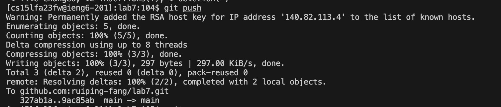

# Lab Report 4 - Vim (Week 7)

## Step 4 : Log into ieng6

- Keys pressed: `Command-C`, `Command-V`, and `<enter>.`

  I first copy the command `ssh cs15lfa23fw@ieng6-201.ucsd.edu` that saved on my note by pressed `Command-C`, and then paste on the terminal by pressed `Command-V`, and then typed `<enter>`

## Step 5 : Clone your fork of the repository from your Github account (using the SSH URL)

- Keys pressed: `Command-C`, `git clone`, ` Command-V`, and ` <enter>`.

  Copy the `ssh` URL `git@github.com:ruiping-fang/lab7.git` of the lab7-report- repository from my Github account by pressing `Command-C` after highlighting that URL and clone that repository into ieng6 by using` git clone`, and pressing ` Command-V`to paste the ssh URL we just copied, and pressed `<enter> `to run the command.

## Step 6 : Run the tests, demonstrating that they fail

- Keys pressed: Type `cd lab7` and press `<enter>`. Then type "bash te", press `<tab>` and `<enter>`.

First, we need to change the working directory to `/lab7` directory, and then run the bash scripts, then press `<tab>` after finishing typing "bash te" in the terminal to speed up the process.

## Step 7: Edit the code file to fix the failing test

- Keys pressed: Type command `vim ListExamples.java` and press `<enter>.`
  In this step, I use `vim` so that I can make editions of the content in the `ListExamples.java` file. After running that command, it shows us the content inside ListExamples.java in normal mode below:

- Keys pressed: first move my cursor below, then press `i`, `<enter>`, then press `delete`. then press `1` for insert 1 after deletes the the wrong index2 , type `<esc>`, press `:wq`

Since we already know that the error in the code is just that `index1` is used instead of `index2` in the final loop in merge. By moving my cursor to the place where cause the error,so we don't need to move our cursor but press `delete` , in this case we can then press `i` and `<enter> ` for insertion. press `1` for insert 1 after deletes the the wrong index`2`.

## Step 8: Run the tests, demonstrating that they now succeed

Keys pressed: type "bash te", press `<tab>` and `<enter>`

We run the bash scrips in `test.sh` again by using bash command to run the tests. Then press` <tab>` after finishing typing "bash te" in the terminal to speed up the process.

## Step 9: Commit and push the resulting change to my Github account

- Keys pressed: `git status`, `git add ListExamples.java `,press `<enter>`. Then, type `git commit -m "fix bug"`, last, press `git push`

  First, we need to check the status before we do anything by pressing `git status`,which tells us what we modified in red color.
  We run the `git add `command on the terminal to stage a file we just edited to be part of the next commit. Then, we run g`it commit` to create a commit locally for all added/staged files. After that, we run `git push` to push all new commits to the remote Github account.

  Here is the update of my GitHub account:
  
