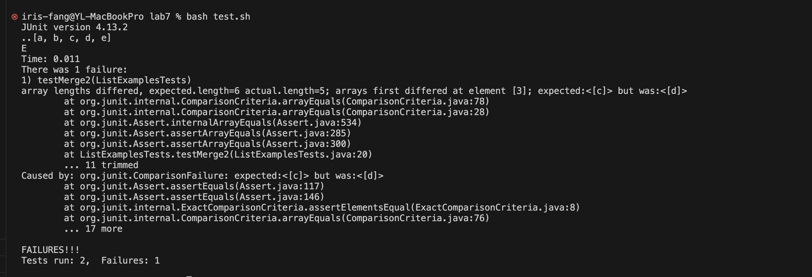

# Lab report 5

## Part 1

### 1. Symptom and a description of a guess at the bug/some sense of what the failure-inducing input is.

Hi the first screenshot is my ListExamples where `merge` method takes two sorted list of strings (so "a" appears before "b" and so on), and return a new list that has all the strings in both list in sorted order.

The symptom is shown on the second screenshot, it suggest that I didn't pass the my second tesh file of test.sh. I guess the bug might be in `merge` method, in the body of `while` loop.The bug might be the `merge` method can't merge the repeated string. But I am not sure if my guess is right, and need help on how to set up the test function

The code block are the two tests method

Can you help me to find the bug in my listExamples?


```
@Test(timeout = 500)
	public void testMerge1() {
		List<String> l1 = new ArrayList<String>(Arrays.asList("x", "y"));
		List<String> l2 = new ArrayList<String>(Arrays.asList("a", "b"));
		assertArrayEquals(new String[] { "a", "b", "x", "y" }, ListExamples.merge(l1, l2).toArray());
	}

@Test(timeout = 500)
	public void testMerge2() {
		List<String> l1 = new ArrayList<String>(Arrays.asList("a", "b", "c"));
		List<String> l2 = new ArrayList<String>(Arrays.asList("c", "d", "e"));
		assertArrayEquals(new String[] { "a", "b", "c", "c", "d", "e" }, ListExamples.merge(l1, l2).toArray());
	}

```

### 2. A respond from a TA

- Reply from Ta

```
There was 1 failure:
1) testMerge2(ListExamplesTests)
array lengths differed, expected.length=6 actual.length=5; arrays first differed at element [3]; expected:<[c]> but was:<[d]>

```

Based on your fail output, I suggests you make a small change of `testMerge2`, you can print out the result list after merging so that you can see what is missing, and then run `bash test.sh`. Here is what I mean

```
	@Test(timeout = 500)
	public void testMerge2() {
		List<String> l1 = new ArrayList<String>(Arrays.asList("a", "b", "c"));
		List<String> l2 = new ArrayList<String>(Arrays.asList("c", "d", "e"));
		List<String> res = ListExamples.merge(l1, l2);
		System.out.println(res);
		assertArrayEquals(new String[] { "a", "b", "c", "c", "d", "e" }, res.toArray());
	}


```

### 3. Another screenshot/terminal output showing what information the student got from trying that, and a clear description of what the bug is.



The bug is `merge` method can't merge the repeated string.
The `l1` have ("a", "b", "c");
The `l2` have ("c", "d", "e");

Expected ("a", "b", "c" "c", "d", "e")

but was ("a", "b", "c", "d", "e")

### 4

- 4.1 The file & directory structure needed
  

- 4.2 The contents of each file before fixing the bug

The contents of `ListExamples.java `


The contents of `ListExamplesTests.java`

```
import static org.junit.Assert.*;
import org.junit.*;
import java.util.*;

public class ListExamplesTests {
	@Test(timeout = 500)
	public void testMerge1() {
		List<String> l1 = new ArrayList<String>(Arrays.asList("x", "y"));
		List<String> l2 = new ArrayList<String>(Arrays.asList("a", "b"));
		assertArrayEquals(new String[] { "a", "b", "x", "y" }, ListExamples.merge(l1, l2).toArray());
	}
	@Test(timeout = 500)
	public void testMerge2() {
		List<String> l1 = new ArrayList<String>(Arrays.asList("a", "b", "c"));
		List<String> l2 = new ArrayList<String>(Arrays.asList("c", "d", "e"));
		assertArrayEquals(new String[] { "a", "b", "c", "c", "d", "e" }, ListExamples.merge(l1, l2).toArray());
	}

}

```

The contents of `tesh.sh`

```
javac -cp .:lib/hamcrest-core-1.3.jar:lib/junit-4.13.2.jar *.java
java -cp .:lib/hamcrest-core-1.3.jar:lib/junit-4.13.2.jar org.junit.runner.JUnitCore ListExamplesTests


```

- 4.3 The full command line (or lines) you ran to trigger the bug
  `bash tesh.sh`

- 4.4 A description of what to edit to fix the bug

  From the output of JUnit test:

  ```
      JUnit version 4.13.2
      ..[a, b, c, d, e]
      E
      Time: 0.011
      There was 1 failure:
      1) testMerge2(ListExamplesTests)
      array lengths differed, expected.length=6 actual.length=5; arrays first differed at element [3]; expected:<[c]> but was:<[d]>

  ```

  We can see that the `merge` method failed to add the same string in the `list2`, so let's take a look at the `merge` method:

  ```
  if (compared == 0) {
      result.add(list1.get(index1));
      index1 += 1;
      index2 += 1;
    }

  ```

  `if (compared == 0) ` deal with the situation when `list1` and `list2` have the same element,but from this code we can see that it only add the element in `list1` to the result,and forgot to add the same element in`list2`. Therefore we only need to add the same element in `list2` to fix the bug, which is:

  ```
      if (compared == 0) {
      result.add(list1.get(index1));
      result.add(list2.get(index2));
      index1 += 1;
      index2 += 1;
    }

  ```

  we run `bash test.sh` again, it shows the bug has been99 fixed:

  

## Part 2 – Reflection

Things I didn't know before are `vim`, and `vim ` modes.
It's also very cool to learn the basic navigation of `vim`, like `h` `j` `k` `l` Move left, down, up, and right, respectively. `$` is to move to the end of the line. `G` is the move to the end of the file.

Another thing I have learned from the lab is how to debug from the the output of the JUnit test, also learned how to write the test function by meself. The lab that ask us to write the grader script to grade student's assignment is also very interesting!
